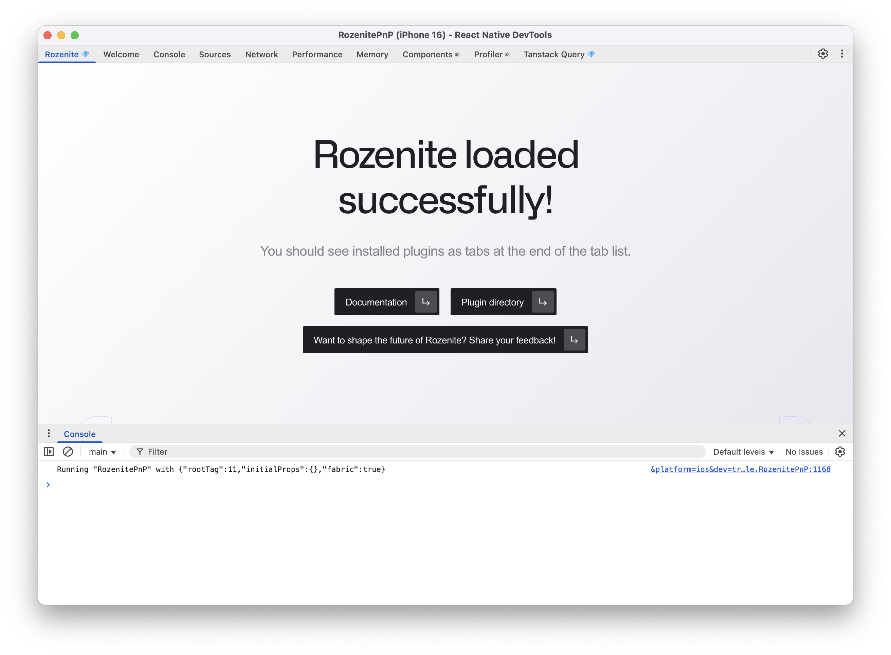
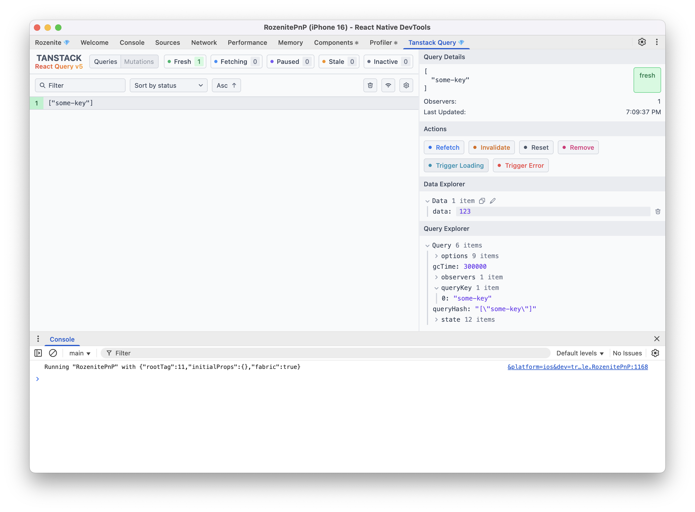

# rozenite-pnp

A demo project for integrating [Rozenite](https://rozenite.dev) in a Yarn PnP environment.

## Preview





## Context

Yarn PnP is not typically used in the React Native ecosystem.
However, it can be used when a custom development environment has been set up.

This example provides a demo for integrating Rozenite in a project with Yarn PnP enabled.

For the demo:

- A custom resolver based on [oxc-resolver](https://www.npmjs.com/package/oxc-resolver) has been configured to the Metro configuration
- Metro has been patched to temporarily work around PnP compatibility issues (see `.yarn/patches`; this does not affect Rozenite integration)

## Setup

### Requirements

- [mise](https://mise.jdx.dev)

```bash
mise trust
mise install

corepack enable
```

## Development

### 1. Build Application

```bash
# Configure nodeLinker to `node-modules` for building the native application
yarn config set nodeLinker node-modules && yarn

# Build Android/iOS applications

# Restore nodeLinker to `pnp`
yarn config set nodeLinker pnp && yarn
```

### 2. Run

```bash
# Start Metro dev server
yarn start
```

### 3. Verify Rozenite Integration

After running `yarn start`, launch the React Native app and press `j` to open the inspector.
Verify that Rozenite is integrated and the plugin is properly registered.
